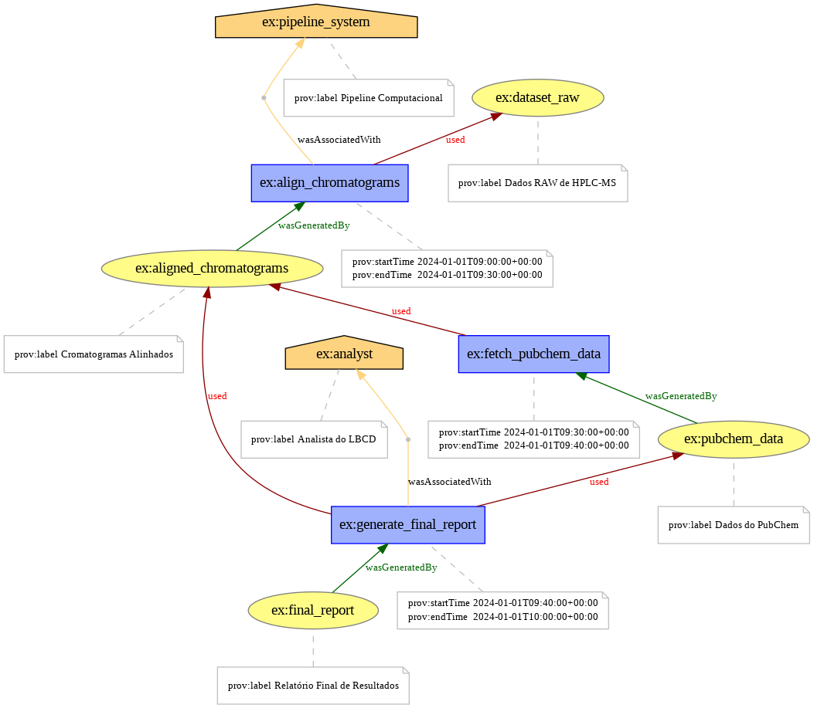

# Sistema Computacional para Apoio no Controle de Dopagem



## Introdução  
Este repositório apresenta um sistema computacional desenvolvido para apoiar os analistas do **Laboratório Brasileiro de Controle de Dopagem (LBCD)** na interpretação de dados cromatográficos gerados em espectrometria de massas de alta resolução (HPLC-MS). O sistema é projetado para processar grandes volumes de dados, reduzir o tempo de análise e minimizar falhas humanas, utilizando ferramentas modernas de ciência de dados e integração com bases de dados químicas, como o **PubChem**.

## Funcionalidades
- **Processamento de dados cromatográficos**: Extração e análise de parâmetros de cromatogramas (tempo de retenção, massas moleculares, entre outros).  
- **Lógica fuzzy**: Tratamento de incertezas e classificação não booleana dos resultados.  
- **Integração com PubChem**: Recuperação de informações químicas detalhadas, como estruturas moleculares, identificadores (CAS), e propriedades físico-químicas.  
- **Visualização gráfica**: Geração de gráficos detalhados para auxiliar na tomada de decisão dos analistas.  
- **Pipeline PROV**: Modelo de proveniência para garantir rastreabilidade e reprodutibilidade.

## Modelo PROV
Abaixo, encontra-se a representação gráfica do modelo PROV do sistema, detalhando as entidades, atividades e agentes envolvidos no pipeline computacional.


## Tecnologias Utilizadas
- **Python** (versão 3.10.0)
- Bibliotecas principais:
  - **pubchempy**: Integração com a base de dados PubChem.
  - **rdkit**: Manipulação de estruturas químicas e cálculo de propriedades moleculares.
  - **pymsfilereader**: Processamento de arquivos RAW de HPLC-MS.
  - **scikit-learn**: Cálculo do coeficiente R² para análise quantitativa.
  - **skfuzzy**: Implementação da lógica fuzzy para interpretação qualitativa dos resultados.
  - **matplotlib** e **pandas**: Visualização e manipulação de dados.
- **Graphviz**: Geração do diagrama PROV.

## Como Executar
1. Clone o repositório:
   ```bash
   git clone https://github.com/seu_usuario/dopinho.git
   ```
2. Instale as dependências:
   ```bash
   pip install -r requirements.txt
   ```
3. Execute o pipeline no notebook disponível:
   ```bash
   jupyter notebook Dopinho_Pipeline.ipynb
   ```

## Licença
Este projeto é distribuído sob a licença MIT. Consulte o arquivo LICENSE para mais informações.

## Contato
Para mais informações ou dúvidas, entre em contato:  
- **Autor**: Guy Junior  
- **E-mail**: guyjunior@iq.ufrj.br 
- **LinkedIn**: [(https://linkedin.com/in/seu-perfil)](https://www.linkedin.com/in/guyjuniorti/)

---

